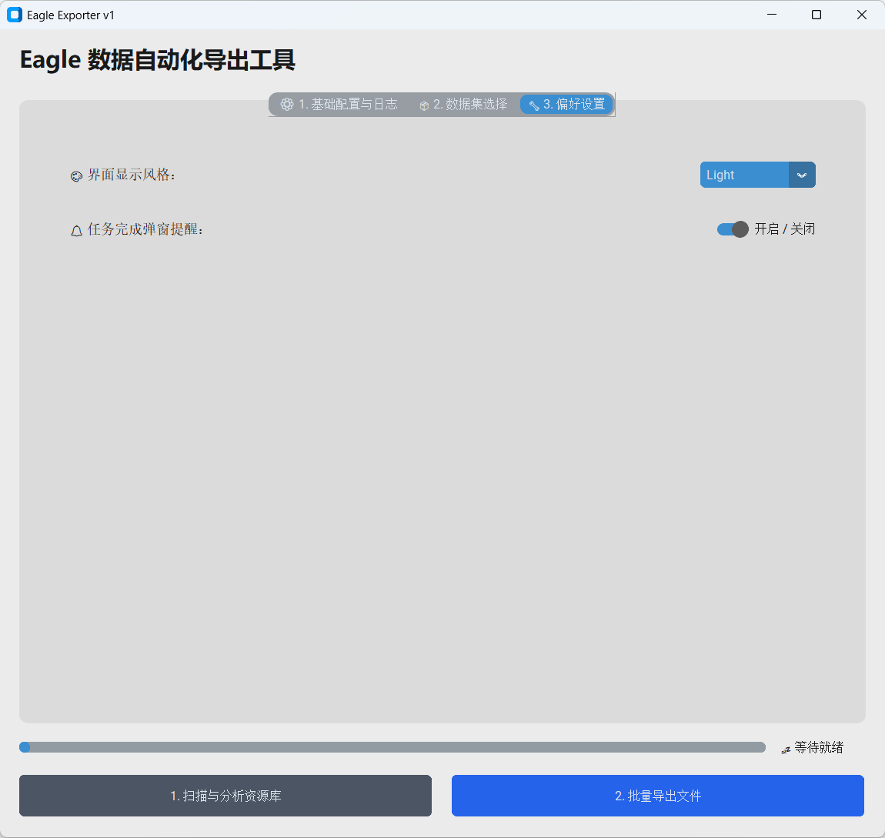
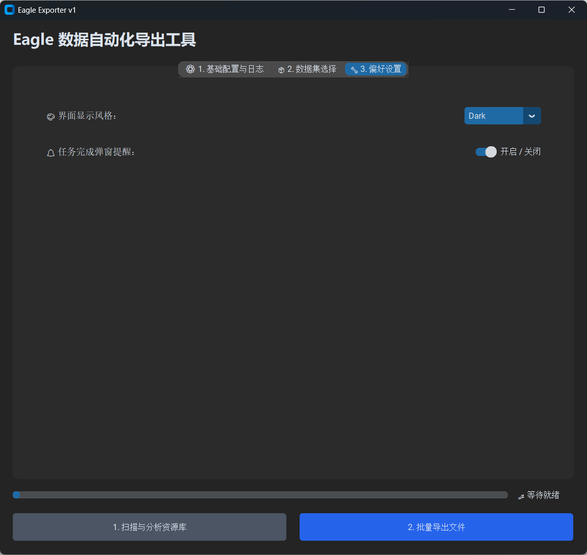
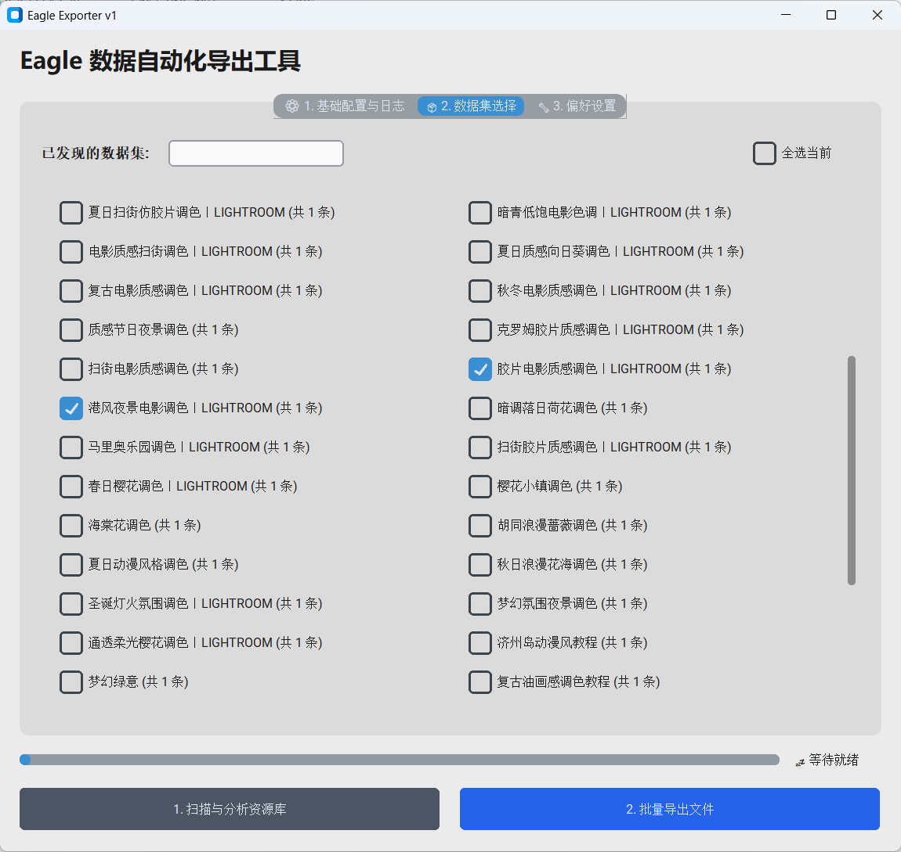
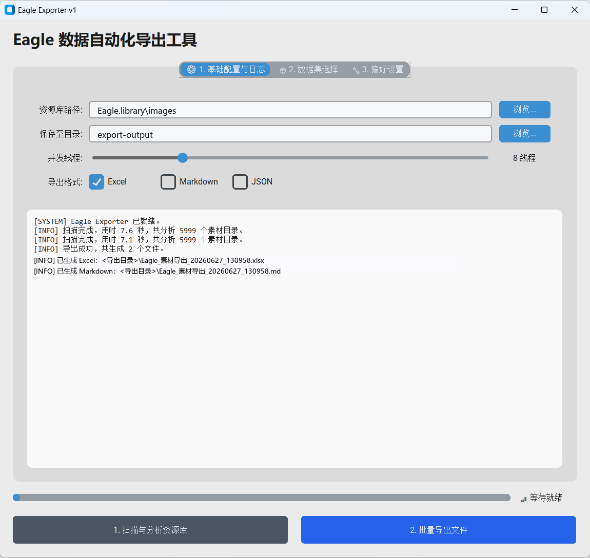
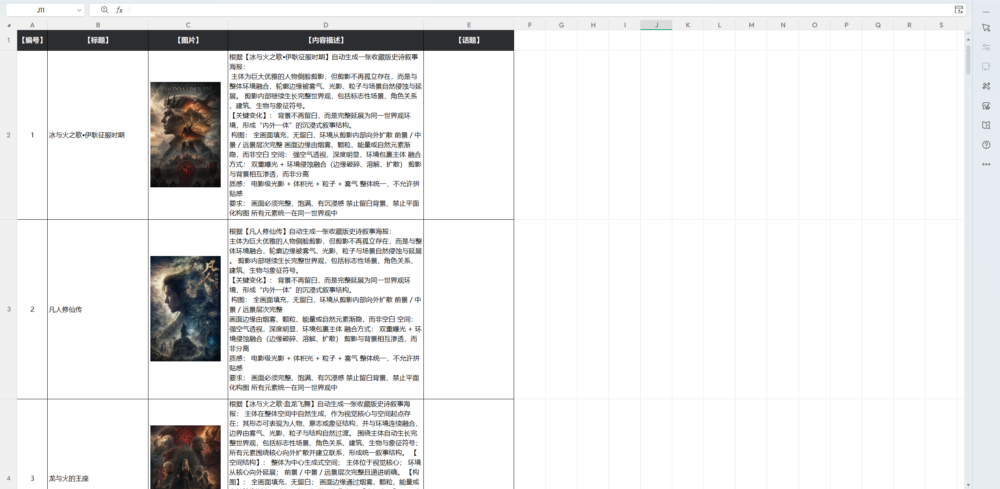

# Eagle Exporter v1

经常使用 Eagle 收集灵感图、商品图、提示词图片或内容素材时，素材量一多，很容易遇到一个问题：图片都在库里，但每张图对应的标题、文案、话题标签和分类信息很难快速浏览、筛选和交付。

Eagle Exporter 就是为这个场景做的本地桌面工具。它会读取 Eagle `.library` 或 `images` 目录中的素材元数据，把图片缩略图、标题、描述、话题标签和分类信息批量整理成 Excel、Markdown 或 JSON 文件，让素材库从“只能一张张翻看”变成“可以表格化查看、筛选、复盘和交付”的内容资产列表。

界面提供 Light / Dark 两种显示风格，适合日常本地使用和演示展示。桌面前端基于开源 UI 库 [CustomTkinter](https://github.com/TomSchimansky/CustomTkinter) 构建，核心扫描、解析和导出逻辑由本项目实现。

## 功能

- 扫描 Eagle `.library` 或 `images` 目录
- 读取素材 `metadata.json` 与缩略图
- 按 Eagle 文件夹分类聚合素材
- 解析小红书话题、普通 hashtag 和常见账号标签
- 导出带缩略图的 Excel 表格
- 导出 Markdown 文案清单
- 可选导出结构化 JSON
- 保存本机路径、导出格式、主题和线程数等偏好配置

## 适用场景

- 素材库积累较多，需要快速查看每张图片对应文案
- 内容运营、设计、短视频或 AI 图片工作流需要批量整理素材
- 需要把 Eagle 内部素材分类转成可交付的 Excel 表格
- 需要把图片描述、话题标签和分类信息留档复盘
- 需要把素材元数据导出为 JSON，交给后续脚本或数据流程继续处理

## 界面与导出效果

项目支持浅色和深色主题切换，主流程分为基础配置、数据集选择和偏好设置。导出的 Excel 文件会保留素材缩略图、标题、内容描述和话题标签，方便横向浏览和人工筛选。

### Light / Dark 双主题

工具使用 CustomTkinter 构建桌面界面，保留了轻量、直接的操作路径，同时支持 Light 和 Dark 两种显示风格。日常整理素材时可以使用浅色界面，长时间查看或夜间处理素材时可以切换到深色界面。

<table>
  <tr>
    <td width="50%">
      
      <br />
      <strong>Light 模式</strong>
      <br />
      在偏好设置中切换界面显示风格，并保留任务完成弹窗提醒开关。
    </td>
    <td width="50%">
      
      <br />
      <strong>Dark 模式</strong>
      <br />
      深色界面适合长时间查看素材列表，减少在夜间整理图片和文案时的视觉压力。
    </td>
  </tr>
</table>

### 按 Eagle 分类选择导出范围

扫描完成后，工具会把 Eagle 文件夹映射成可勾选的数据集。用户可以只导出当前要整理的分类，而不是把整个素材库一次性全部导出，适合按项目、主题、平台或内容方向分批处理。



### 扫描与批量导出

基础配置页聚合了资源库路径、导出目录、并发线程和导出格式。日志区会展示扫描数量、耗时和生成结果，便于确认本次导出是否完成。展示图中的本地路径已做脱敏处理。



### Excel 表格化查看素材

Excel 导出会把图片缩略图、标题、内容描述和话题标签放在同一张表里。相比在 Eagle 里逐张打开图片，这种方式更适合横向浏览、筛选、复盘和交付，尤其适合素材量已经积累到几百或几千张的情况。



## 项目结构

```text
eagle-exporter
├─ eagle_exporter/
│  ├─ app.py
│  ├─ config.py
│  ├─ models.py
│  ├─ services/
│  │  ├─ scanner.py
│  │  └─ exporters.py
│  ├─ ui/
│  │  └─ main_window.py
│  └─ utils/
│     └─ logging_utils.py
├─ tests/
├─ pyproject.toml
├─ requirements.txt
└─ README.md
```

## 安装

建议使用虚拟环境：

```bash
python -m venv .venv
.venv\Scripts\activate
python -m pip install -e .
```

也可以只安装运行依赖：

```bash
python -m pip install -r requirements.txt
```

## 运行

源码方式运行：

```bash
python -m eagle_exporter.app
```

安装后也可以使用命令行入口：

```bash
eagle-exporter
```

打开界面后选择 Eagle 资源库目录和导出目录，先扫描资源库，再选择需要导出的分类和格式。

## 数据边界

- 本工具只读取本地 Eagle 资源库文件，不上传素材或元数据。
- 配置文件 `eagle_exporter/eagle_config.json` 只保存在本机，已默认加入 `.gitignore`。
- JSON 导出中可能包含本机素材路径，公开分享前请自行脱敏。
- 导出的 Excel、Markdown、JSON 文件默认不应提交到公开仓库。

## 开源组件

- [CustomTkinter](https://github.com/TomSchimansky/CustomTkinter)：桌面界面组件
- [Pillow](https://python-pillow.org/)：图片读取与缩略图处理
- [XlsxWriter](https://xlsxwriter.readthedocs.io/)：Excel 文件生成

## 测试

```bash
python -m pytest -q --basetemp .pytest-tmp
```

测试覆盖扫描路径识别、元数据解析、话题提取、去重、Excel/Markdown/JSON 导出和工作表名称清洗等核心逻辑。
